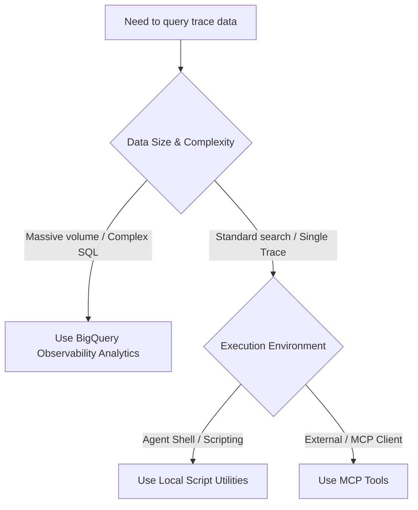

# Workflow: Trace Querying Decision Tree

This guide helps agents select the optimal method for querying distributed
traces in a GCP environment.

## Overview of Querying Methods

There are three primary ways to search and fetch trace telemetry:

1.  **Local Script Utilities**
2.  **Model Context Protocol (MCP) Tools**
3.  **Observability Analytics (BigQuery SQL)**

## Decision Tree & Recommendations

### 1. Local Script Utilities (Recommended First)

*   **When**: Searching traces, fetching spans, or extracting correlated logs in
    the local shell.
*   **Why**: Scripts (e.g. `search_traces`, `fetch_related_logs`) are optimized
    for token usage and output formatting. They group results cleanly to prevent
    context bloat.
*   **Key Commands**:
    -   Search: `./scripts/search_traces/run.sh --filter "latency:2s"`
    -   Logs: `./scripts/fetch_related_logs/run.sh --trace-id TRACE_ID`

### 2. Model Context Protocol (MCP) Tools

*   **When**: Operating via an external client that connects to the Cloud Trace
    MCP server.
*   **Why**: The MCP server exposes direct schema-backed tools (`list_traces`
    and `get_trace`). Note that MCP endpoints might have permissions/access in
    sandboxed environments that local scripts do not have access to.

### 3. Observability Analytics (BigQuery)

*   **When**: Conducting aggregate analysis, calculating complex stats (e.g.
    percentiles over time), or joining traces with system logs.
*   **Why**: Provides full SQL querying capabilities over massive datasets.
*   **Link**:
    [Observability Analytics (BigQuery SQL)](./querying-observability-analytics.md)

## See Also

*   [Cloud Trace MCP Tools](./querying-mcp.md)
*   [Cloud Trace API (v1) Query Syntax](./filter-syntax.md)
