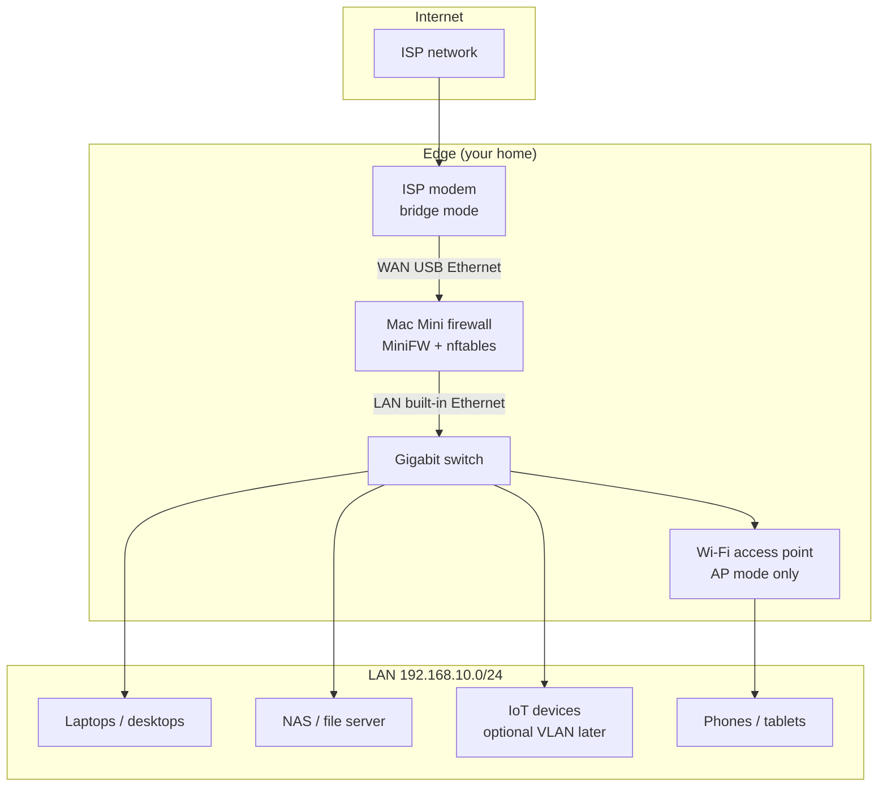
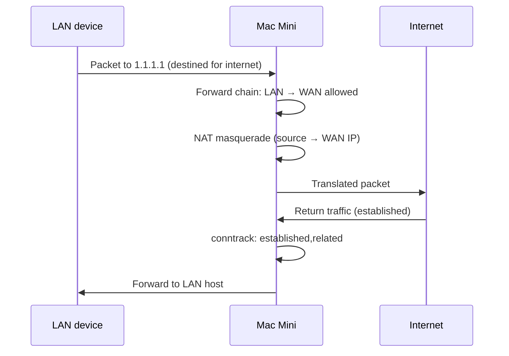
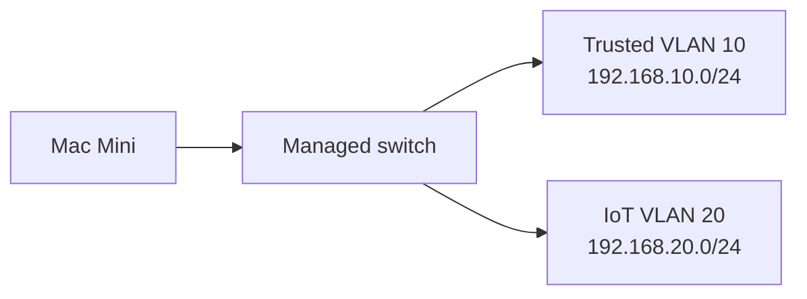
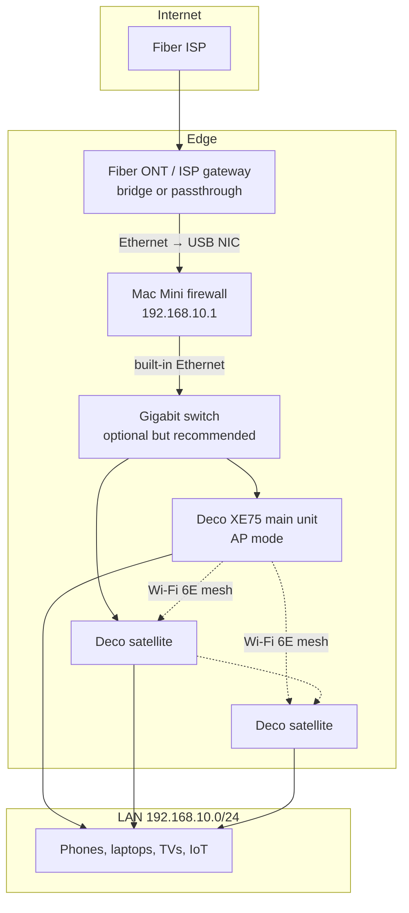
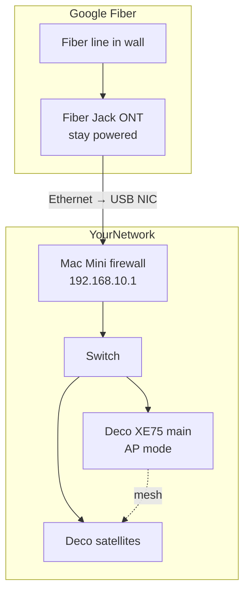

# Network topology for Mac Mini firewall

This guide covers the recommended home network layout when using a 2014 Mac Mini as your primary router and firewall.

## Recommended topology

Put the ISP modem in **bridge mode** (also called passthrough or IP passthrough). The Mac Mini becomes the only router on your network.



## Physical wiring

```
[ISP fibre/cable] → [ISP modem] → [USB Ethernet → Mac Mini WAN port]
                                         ↓
                              [Built-in Ethernet → Switch]
                                         ↓
                    ┌────────────────────┼────────────────────┐
                    ↓                    ↓                    ↓
              [Wi-Fi AP]            [Desktop]              [NAS]
              (AP mode)
```

### Port assignment

| Mac Mini port | Cable goes to | Role |
|---------------|---------------|------|
| USB Ethernet adapter | ISP modem LAN port | **WAN** — public internet |
| Built-in Ethernet | Gigabit switch | **LAN** — trusted home network |

> **Important:** Do not plug the ISP modem into the built-in port and the switch into USB. Either works technically, but USB-as-WAN is the usual convention and keeps the built-in port on the trusted LAN side.

## IP addressing

| Device | IP | Notes |
|--------|-----|-------|
| Mac Mini (LAN) | `192.168.10.1` | Gateway, DNS, DHCP server |
| DHCP pool | `192.168.10.100` – `192.168.10.250` | Managed by MiniFW/dnsmasq |
| Wi-Fi AP | `192.168.10.2` (static) | AP mode; no DHCP |
| Servers/NAS | `192.168.10.10` – `99` | Reserve low addresses |

Use a subnet other than `192.168.0.0/24` or `192.168.1.0/24` if your ISP modem (before bridging) used those — it avoids conflicts during setup.

## ISP modem: bridge mode

Bridge mode disables the modem's router/NAT/DHCP so the Mac Mini receives the public IP (or a DHCP lease directly from the ISP).

| Provider type | What to look for |
|---------------|------------------|
| Cable (DOCSIS) | "Bridge mode" in modem admin |
| Fibre (ONT) | Often already bridged; may need provider to enable |
| DSL | "Modem only" or bridge mode in router settings |

After bridging, only the Mac Mini WAN interface should request a DHCP address from the ISP (or use your static IP details from the ISP).

## Wi-Fi access point setup

Use a dedicated AP or a router flashed to AP mode. **Disable DHCP and NAT on the AP.**

1. Connect AP LAN port → switch (not the AP's "WAN" port unless docs say otherwise).
2. Set AP management IP to `192.168.10.2`.
3. Set gateway/DNS to `192.168.10.1` (the Mac Mini).
4. Use WPA3 or WPA2-AES. Separate guest SSID if the AP supports it.

## Traffic flow



Inbound connections from the internet are **blocked by default**. Open ports only via `allowed_wan_ports` or `port_forwards` in the config.

## Optional improvements

### 1. DNS ad-blocking

Add Pi-hole or AdGuard Home on the Mac Mini (Docker) or a LAN host, then point `dns_servers` in `firewall.yaml` to that host.

### 2. IoT isolation (VLAN)

The 2014 Mac Mini + managed switch can separate IoT traffic:



Requires a managed switch with 802.1Q VLAN support. MiniFW does not configure VLANs yet; add `nftables` VLAN rules or use switch ACLs.

### 3. VPN for remote access

Run WireGuard on the Mac Mini instead of exposing services to the internet:

```
Internet → Mac Mini:51820/udp (WireGuard) → access LAN securely
```

Prefer VPN over port-forwarding for home automation, NAS, etc.

## What not to do

| Avoid | Why |
|-------|-----|
| Double NAT (modem routing + Mac Mini routing) | Breaks port forwarding, adds latency, complicates troubleshooting |
| Wi-Fi router in router mode behind the Mac Mini | Creates a second NAT'd network |
| Relying on Wi-Fi from the Mac Mini | No built-in Wi-Fi on most Mac Minis; use an AP |
| macOS as the router OS | Possible with `pf`, but Apple does not support it well; Linux is more reliable |

## macOS alternative (not recommended for 24/7 router)

If you must stay on macOS, enable IP forwarding and use `pf`, but you lose easy NAT/DHCP integration and macOS updates can reset settings. Ubuntu Server on the same hardware is the better path for a dedicated firewall.

## Setup checklist

- [ ] Install Ubuntu Server 24.04 on the Mac Mini
- [ ] Buy USB 3.0 Gigabit Ethernet adapter (~$15–25)
- [ ] Put ISP modem in bridge mode
- [ ] Cable WAN/LAN as shown above
- [ ] Run `scripts/detect-interfaces.sh` and update `firewall.yaml`
- [ ] Assign static IP `192.168.10.1/24` to the LAN interface (netplan)
- [ ] Run `minifw apply` and enable `nftables` + `dnsmasq`
- [ ] Configure Wi-Fi AP in AP mode
- [ ] Verify: `curl ifconfig.me` from a LAN device shows your public IP
- [ ] Verify: inbound ports are closed (use [canyouseeme.org](https://canyouseeme.org) sparingly)

## Fiber + TP-Link Deco XE75

This section covers the common case: **fiber internet** with an ISP ONT/gateway and a **Deco XE75** mesh system (2- or 3-pack).

### Topology



### Physical wiring

```
[Fiber] → [ISP ONT or gateway] → [USB Ethernet → Mac Mini WAN]
                                        ↓
                           [Built-in Ethernet → Switch]
                                        ↓
              ┌─────────────────────────┼─────────────────────────┐
              ↓                         ↓                         ↓
      [Deco main XE75]          [Deco satellite]           [Desktop / NAS]
      (AP mode, wired)          (ethernet backhaul)         (optional)
```

**Recommended:** Use a **gigabit switch** on the Mac Mini LAN port. Plug the main Deco and any satellites that support wired backhaul into the switch. Wired backhaul in AP mode keeps mesh traffic off the main Deco and performs better than wireless-only backhaul.

### Fiber ONT / ISP gateway

Fiber setups vary by provider. The goal is the same: **only the Mac Mini should route and NAT**.

| ISP setup | What to do |
|-----------|------------|
| Standalone ONT with one Ethernet port | Plug that port straight into Mac Mini WAN. ONT is usually already a bridge. |
| ONT + separate ISP router (common) | Put the ISP router in **bridge**, **passthrough**, or **IP passthrough** mode so the Mac Mini gets the public IP. |
| ISP gateway with no bridge mode | Call ISP and ask for "bridge mode" or "public IP on my equipment." Some allow **DMZ** to the Mac Mini WAN IP as a fallback (not ideal, but works). |
| ISP gateway with VoIP / TV | Keep the gateway for phone/TV if required, but still bridge or passthrough data to the Mac Mini. Do **not** run the Deco in router mode behind the Mac Mini. |

After setup, `curl ifconfig.me` from a phone on Deco Wi-Fi should show your **public** IP, not `192.168.x.x`.

### Deco XE75: Access Point mode

Do **not** use the Deco as your router — the Mac Mini is the router. The XE75 becomes your Wi-Fi mesh only.

1. **Initial setup in Router mode** (Deco app requirement): plug main Deco into the switch, complete setup in the TP-Link Deco app.
2. **Switch to AP mode**: Deco app → **More** → **Advanced** → **Operation Mode** → **Access Point** → Save → Reboot.
3. One change applies to **all** Deco units in the mesh automatically.
4. After reboot, the Deco no longer runs DHCP or NAT. The Mac Mini (`192.168.10.1`) handles both.

Reference: [TP-Link Deco AP mode FAQ](https://www.tp-link.com/us/support/faq/1842/)

### IP addressing with Deco

| Device | IP | Notes |
|--------|-----|-------|
| Mac Mini (LAN) | `192.168.10.1` | Gateway, DHCP, DNS |
| Main Deco XE75 | `192.168.10.2` (reserve in dnsmasq) | Management UI via Deco app |
| Deco satellites | DHCP from Mac Mini | Assigned automatically |
| Phones / laptops | `192.168.10.100+` | DHCP pool from MiniFW |

If your ISP gateway or mesh router uses a different default subnet, switching to `192.168.10.0/24` on the Mac Mini avoids conflicts.

### Deco features in AP mode

| Feature | In AP mode |
|---------|------------|
| Mesh Wi-Fi / 6E band | Works |
| DHCP / NAT / firewall | Handled by Mac Mini |
| Deco parental controls / HomeShield | May be limited or disabled — use Mac Mini firewall rules instead |
| Wired ethernet backhaul | Works; recommended via switch |
| Multiple Decos wired to switch | Supported in AP mode (not in router mode) |

### Fiber + Deco checklist

- [ ] Confirm ONT/gateway is bridged or in passthrough
- [ ] Mac Mini WAN (USB Ethernet) ← ONT/gateway Ethernet
- [ ] Mac Mini LAN (built-in) → gigabit switch
- [ ] Main Deco XE75 → switch (not the ISP gateway)
- [ ] Complete Deco setup, then switch to **Access Point** mode
- [ ] Wire satellite Decos to switch if possible (ethernet backhaul)
- [ ] Run `minifw apply` on the Mac Mini
- [ ] Verify public IP from a Wi-Fi client: `curl ifconfig.me`
- [ ] Disable Wi-Fi on the ISP gateway (if it still routes) to avoid a second network

## Google Fiber + Deco XE75

Google Fiber is one of the easiest ISPs for a custom router — **you do not need bridge mode**. Unplug the Network Box and connect your Mac Mini directly to the **Fiber Jack**.

### Your equipment (from photos)

| Device | What it is | What to do |
|--------|------------|------------|
| Small black/white box (fiber entry) | **Fiber Jack** (ONT) | Keep powered; Ethernet goes to Mac Mini WAN |
| White box with GF logo, Wi-Fi LED | **Network Box** (ISP router) | **Unplug and remove** from the chain |
| Deco XE75 mesh | Your Wi-Fi | AP mode only; plug into Mac Mini LAN |

### Topology



### Wiring steps

1. **Leave the Fiber Jack powered** (it has its own power adapter — do not unplug that).
2. **Disconnect the Network Box:**
   - Unplug the Ethernet cable from the Fiber Jack → Network Box
   - Unplug Network Box power
   - Store the Network Box (return to Google if you cancel service)
3. **Connect Mac Mini:**
   - Fiber Jack Ethernet → USB Ethernet adapter → Mac Mini **WAN**
   - Mac Mini built-in Ethernet → gigabit switch
   - Switch → Deco XE75 main unit (and wired satellites if possible)
4. **Configure Mac Mini WAN for DHCP** (Google assigns your public IP automatically).
5. **Switch Deco to AP mode** (Deco app → More → Advanced → Operation Mode → Access Point).

```
BEFORE (current):
  Fiber Jack ──yellow──► Network Box ──Wi-Fi/LAN──► your devices

AFTER (target):
  Fiber Jack ──────────► Mac Mini WAN
                              ↓
                         Mac Mini LAN ──► Switch ──► Deco XE75 (AP mode)
```

### Google Fiber WAN settings

For most current residential installs, **plain DHCP on WAN is enough** — no VLAN tagging.

| Setting | Value |
|---------|-------|
| WAN mode | DHCP (automatic) |
| VLAN | None (try this first) |
| IPv6 | DHCPv6 enabled (optional, Google supports it) |

**If WAN does not get an IP** (older installs in some cities), your Fiber Jack may still expect **VLAN 2** with CoS priority 3. Add to your Mac Mini netplan or `systemd-networkd` config:

```yaml
# Example netplan snippet for VLAN 2 fallback
vlans:
  wan-vlan2:
    id: 2
    link: enxYOUR_USB_NIC
    dhcp4: true
```

Try without VLAN first. Only add VLAN 2 if DHCP on the raw interface fails after 5+ minutes.

### Network Box: do not use it

The Network Box has **no bridge mode**. Running it in front of or behind the Mac Mini creates double NAT. Google officially supports bypassing it:

> Connect your router's WAN port directly to the Fiber Jack Ethernet port.
> — [Google Fiber: Use your own router](https://support.google.com/fiber/answer/2446100)

### Google Fiber + Deco checklist

- [ ] Fiber Jack stays powered (separate adapter)
- [ ] Network Box disconnected and removed from chain
- [ ] Fiber Jack Ethernet → Mac Mini USB WAN
- [ ] Mac Mini LAN → switch → Deco XE75
- [ ] Deco in **Access Point** mode (not router mode)
- [ ] Mac Mini WAN set to DHCP
- [ ] Run `minifw apply`
- [ ] Test: `curl ifconfig.me` from phone on Deco Wi-Fi shows public IP
- [ ] Optional: disable Network Box Wi-Fi is moot — box is unplugged

### Support note

Google Fiber support can only troubleshoot up to the Fiber Jack when using your own router. If the Fiber Jack has a solid light but the Mac Mini WAN gets no IP, the issue is on your Mac Mini config (or rare VLAN 2 requirement), not Google's network.
