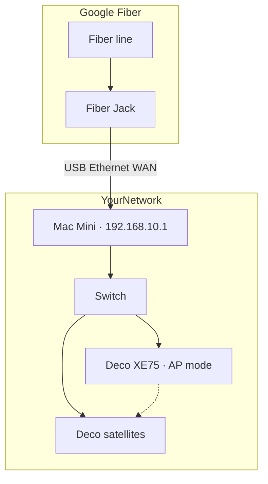

# Topology Overview

← [[Home]] · See also [[Google Fiber and Deco XE75]]

---

## Target layout

---

## Port assignment

| Mac Mini port | Connects to | Role |
|---------------|-------------|------|
| USB Ethernet | Fiber Jack | **WAN** |
| Built-in Ethernet | Gigabit switch | **LAN** |

---

## Traffic flow

1. LAN device → Mac Mini (`192.168.10.1`)
2. Mac Mini NAT/masquerade → WAN (public IP)
3. Return traffic via conntrack (established)

Inbound from internet **blocked by default**. Open ports only via [[Config Files#firewall.yaml]].

---

## Optional improvements

### DNS ad-blocking
Pi-hole or AdGuard on Mac Mini or LAN host → update `dns_servers` in [[Config Files#firewall.yaml]].

### IoT VLAN
Requires managed switch with 802.1Q. Not configured by default.

### WireGuard VPN
Prefer over port-forwarding for remote access to NAS, home automation, etc.

---

## What not to do

| Avoid | Why |
|-------|-----|
| Network Box + Mac Mini both routing | Double NAT |
| Deco in router mode behind Mac Mini | Second NAT network |
| Wi-Fi from Mac Mini | No built-in Wi-Fi — use Deco |

---

## Related

- [[Google Fiber and Deco XE75]]
- [[IP Address Plan]]
- [[Phase 4 - Cutover]]
